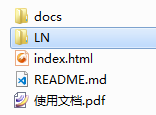
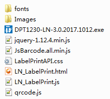

# 重庆理念标签打印机接口使用文档

为了便于用户能够快速的完成接口集成工作，现提供该文档供用户参考；

## 目录

* [使用方法](#使用方法)
* [报文格式](#报文格式)
* [参考代码](#参考代码)
* [接口说明](#接口说明)
* [代码结构](#代码结构)

## 使用方法

1. 导入接口代码，将接口包中<font color="red"><b>LN</b></font>文件夹下的所有文件导入到项目的相关位置；<br>


2. 引入接口js文件

    ```html
    <script src="./LN/LN_LabelPrint.js"></script>
    ```

3. 调用接口函数，打开预览界面，并进行相关打印操作

    ```JavaScript
    var xmlData = "...";
    var url = "./LN/LN_LabelPrint.html";
    LnPrintEntry.printLabel(xmlData, url);
    ```

## 报文格式

```xml
<?xml version="1.0" encoding="utf-8" ?>
<Data>
    <Print>
        <PrintType>4001</PrintType>
        <Text>机房名称：东郊新华局T01</Text>
        <Text>产权性质：</Text>
        <Code>5301001100087760</Code>
    </Print>
    ...
    <Print>
        ...
    </Print>
</Data>
```

```XML
XML格式说明：
    <Data>：XML字符串根节点；
    <Print>:报文中一个Print节点表示一张标签，如果需要同时传递多张标签，只需要在报文中同时传递
        多个Print报文即可；
    <PrintType>:打印类型，不同的标签可以用该节点来进行区分，具体内容需要双方进行约定；
    <Text>:用于传递需要打印的字符串数据，至于Text的个数，以及排版，需要双方进行约定才可进行；
    <Code>:用于传递一维码或者二维码数据；
	
注：以上格式仅供参考，具体格式需要双方进行约定；
```

## 参考代码

```html
<script src="./LN/LN_LabelPrint.js"></script>
<script type="text/javascript">

    function printTemplate_1() {
        var xmlData = "";
        xmlData += "<?xml version=\"1.0\" encoding=\"utf-8\" ?>";
        xmlData += "<Data>";
        xmlData += "    <Print>";
        xmlData += "        <PrintType>4001</PrintType>";
        xmlData += "        <Text>机房名称：东郊新华局T01</Text>";
        xmlData += "        <Text>产权性质：电信</Text>";
        xmlData += "        <Code>5301001100087760</Code>";
        xmlData += "    </Print>";
        xmlData += "</Data>";

        // 一般情况下url可以省略，但是个别情况下必须指定正确的url；
        var url = "./LN/LN_LabelPrint.html";
        LnPrintEntry.printLabel(xmlData, url);
    }

</script>
```
  <font color=blue size=4>详细信息可参考 Index.html文件；</font>

## 接口说明

1. LnPrintEntry接口说明；

```JavaScript

    /**
     * 打开标签打印预览界面，进行打印操作；
     * @param xmlData xml格式的标签打印数据；
     * @param url 预览界面url地址，根据实际情况，可以不指定；
     */
    printLabel: function (xmlData, url)
```

## 代码结构

1. fonts、Images文件夹：预览界面所以来的相关图标或者背景图；
2. DPT1230-LN-*.exe：标签打印插件；
3. jquery-*.js:为了实现对低版本浏览器的兼容处理，接口引入了jquery.js；
4. JsBarcode.js:用于在预览界面一维码；
5. qrcode.js：用于在预览界面生成二维码；
6. LN_LabelPrint.js：标签打印相关代码；
7. LN_LabelPrint.html：标签打印预览界面；
8. LabelPrintAPI.css：预览界面相关标签的样式表；

   
